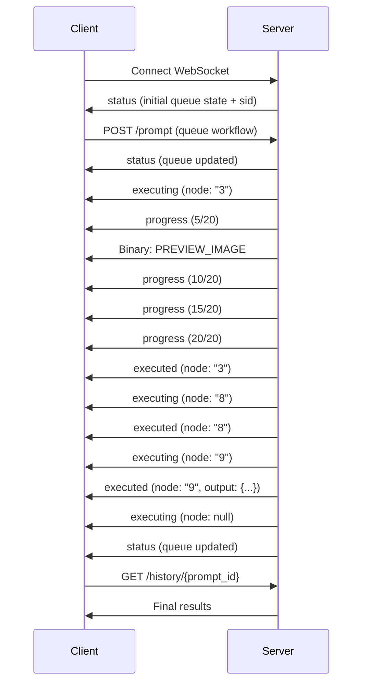

## Event Categories

ComfyUI WebSocket events are divided into two categories:

<CardGroup cols={2}>
  <Card title="JSON Events" icon="code">
    Text-based messages sent as JSON objects for workflow state changes
  </Card>
  <Card title="Binary Events" icon="image">
    Binary messages containing preview images and other binary data
  </Card>
</CardGroup>

## JSON Events

JSON events follow this structure:

```json
{
  "type": "event_name",
  "data": { /* event-specific data */ }
}
```

### status

Sent when the queue status changes or on initial connection. Contains information about the current execution queue.

<ParamField body="data.status" type="object" required>
  <Expandable title="properties">
    <ParamField body="exec_info" type="object">
      <Expandable title="properties">
        <ParamField body="queue_remaining" type="integer">
          Number of prompts remaining in the queue
        </ParamField>
      </Expandable>
    </ParamField>
  </Expandable>
</ParamField>

<ParamField body="data.sid" type="string">
  Session ID (only included in the initial connection message)
</ParamField>

#### Example

```json
{
  "type": "status",
  "data": {
    "status": {
      "exec_info": {
        "queue_remaining": 3
      }
    },
    "sid": "a1b2c3d4e5f6789012345678"
  }
}
```

### executing

Sent when a node begins execution or when execution completes.

<ParamField body="data.node" type="string | null" required>
  The ID of the node currently executing. `null` indicates that execution has completed.
</ParamField>

<ParamField body="data.display_node" type="string">
  The ID of the node to display in the UI (may differ from the executing node for optimization)
</ParamField>

<ParamField body="data.prompt_id" type="string" required>
  The unique identifier for the workflow execution
</ParamField>

#### Example: Node Execution

```json
{
  "type": "executing",
  "data": {
    "node": "3",
    "display_node": "3",
    "prompt_id": "550e8400-e29b-41d4-a716-446655440000"
  }
}
```

#### Example: Execution Complete

```json
{
  "type": "executing",
  "data": {
    "node": null,
    "prompt_id": "550e8400-e29b-41d4-a716-446655440000"
  }
}
```

<Warning>
  When `node` is `null`, the workflow execution is complete. This is the signal to retrieve final outputs from the `/history` endpoint.
</Warning>

### executed

Sent when a node completes execution successfully.

<ParamField body="data.node" type="string" required>
  The ID of the node that finished executing
</ParamField>

<ParamField body="data.display_node" type="string">
  The ID of the node displayed in the UI
</ParamField>

<ParamField body="data.output" type="object">
  The UI output from the node (e.g., generated images, text)
</ParamField>

<ParamField body="data.prompt_id" type="string" required>
  The unique identifier for the workflow execution
</ParamField>

#### Example

```json
{
  "type": "executed",
  "data": {
    "node": "9",
    "display_node": "9",
    "output": {
      "images": [
        {
          "filename": "ComfyUI_00001_.png",
          "subfolder": "",
          "type": "output"
        }
      ]
    },
    "prompt_id": "550e8400-e29b-41d4-a716-446655440000"
  }
}
```

### progress

Sent during node execution to report progress (e.g., sampling steps).

<ParamField body="data.value" type="integer" required>
  Current progress value (e.g., current step)
</ParamField>

<ParamField body="data.max" type="integer" required>
  Maximum progress value (e.g., total steps)
</ParamField>

<ParamField body="data.prompt_id" type="string">
  The unique identifier for the workflow execution
</ParamField>

<ParamField body="data.node" type="string">
  The ID of the node reporting progress
</ParamField>

#### Example

```json
{
  "type": "progress",
  "data": {
    "value": 15,
    "max": 20,
    "prompt_id": "550e8400-e29b-41d4-a716-446655440000",
    "node": "3"
  }
}
```

### execution_error

Sent when an error occurs during workflow execution.

<ParamField body="data.prompt_id" type="string" required>
  The unique identifier for the failed workflow execution
</ParamField>

<ParamField body="data.node_id" type="string">
  The ID of the node that caused the error
</ParamField>

<ParamField body="data.exception_message" type="string">
  Human-readable error message
</ParamField>

<ParamField body="data.exception_type" type="string">
  The type of exception that occurred
</ParamField>

<ParamField body="data.traceback" type="string">
  Full Python traceback for debugging
</ParamField>

#### Example

```json
{
  "type": "execution_error",
  "data": {
    "prompt_id": "550e8400-e29b-41d4-a716-446655440000",
    "node_id": "3",
    "exception_message": "Error: invalid seed value",
    "exception_type": "ValueError",
    "traceback": "Traceback (most recent call last):\n..."
  }
}
```

### feature_flags

Exchanged between client and server to negotiate supported features.

<ParamField body="data" type="object" required>
  Key-value pairs of feature flags and their support status (boolean)
</ParamField>

#### Example: Server Features

```json
{
  "type": "feature_flags",
  "data": {
    "binary_preview_images": true,
    "image_metadata": true,
    "workflow_execution_api": true
  }
}
```

### logs

Sent when server logs are available (if log streaming is enabled).

<ParamField body="data.entries" type="array" required>
  Array of log entry objects
</ParamField>

<ParamField body="data.size" type="integer">
  Total size of log data
</ParamField>

#### Example

```json
{
  "type": "logs",
  "data": {
    "entries": [
      {"level": "info", "message": "Model loaded successfully"},
      {"level": "warning", "message": "GPU memory low"}
    ],
    "size": 1024
  }
}
```

## Binary Events

Binary messages use a structured format:

```
[4 bytes: event type ID (big-endian)][remaining bytes: binary data]
```

### Event Type IDs

Defined in `protocol.py`:

```python
class BinaryEventTypes:
    PREVIEW_IMAGE = 1
    UNENCODED_PREVIEW_IMAGE = 2
    TEXT = 3
    PREVIEW_IMAGE_WITH_METADATA = 4
```

### PREVIEW_IMAGE (Type 1)

Contains an encoded preview image generated during workflow execution.

#### Format

```
[4 bytes: type = 1][4 bytes: image type][image data]
```

<ParamField path="Image Type" type="integer">
  - `1`: JPEG format
  - `2`: PNG format
</ParamField>

#### Decoding Example

```python
import struct
from PIL import Image
from io import BytesIO

def decode_preview_image(binary_data):
    # Read event type (first 4 bytes)
    event_type = struct.unpack(">I", binary_data[:4])[0]
    
    if event_type == 1:  # PREVIEW_IMAGE
        # Read image type (next 4 bytes)
        image_type = struct.unpack(">I", binary_data[4:8])[0]
        
        # Extract image data
        image_data = binary_data[8:]
        
        # Open with PIL
        image = Image.open(BytesIO(image_data))
        return image
```

### PREVIEW_IMAGE_WITH_METADATA (Type 4)

Contains a preview image along with metadata (requires feature flag negotiation).

#### Format

```
[4 bytes: type = 4][4 bytes: metadata length][metadata JSON][image data]
```

<ParamField path="Metadata Length" type="integer">
  Length of the JSON metadata in bytes (big-endian)
</ParamField>

<ParamField path="Metadata JSON" type="object">
  JSON object containing metadata about the image
  <Expandable title="properties">
    <ParamField path="image_type" type="string">
      MIME type: `"image/png"` or `"image/jpeg"`
    </ParamField>
    <ParamField path="node_id" type="string">
      ID of the node that generated the preview
    </ParamField>
    <ParamField path="prompt_id" type="string">
      The workflow execution ID
    </ParamField>
  </Expandable>
</ParamField>

#### Decoding Example

```python
import struct
import json
from PIL import Image
from io import BytesIO

def decode_preview_with_metadata(binary_data):
    # Read event type (first 4 bytes)
    event_type = struct.unpack(">I", binary_data[:4])[0]
    
    if event_type == 4:  # PREVIEW_IMAGE_WITH_METADATA
        # Read metadata length (next 4 bytes)
        metadata_length = struct.unpack(">I", binary_data[4:8])[0]
        
        # Extract and parse metadata
        metadata_json = binary_data[8:8+metadata_length].decode('utf-8')
        metadata = json.loads(metadata_json)
        
        # Extract image data
        image_data = binary_data[8+metadata_length:]
        
        # Open with PIL
        image = Image.open(BytesIO(image_data))
        
        return image, metadata

# Example usage
image, metadata = decode_preview_with_metadata(binary_message)
print(f"Image type: {metadata['image_type']}")
print(f"From node: {metadata.get('node_id')}")
image.show()
```

### UNENCODED_PREVIEW_IMAGE (Type 2)

Raw unencoded preview image data (rarely used in practice).

### TEXT (Type 3)

Binary text data (rarely used; most text is sent as JSON).

## Event Flow Example

Here's a typical sequence of events when executing a workflow:



## Complete Integration Example

Here's a production-ready example that handles all event types:

```python
import websocket
import uuid
import json
import struct
from PIL import Image
from io import BytesIO

class ComfyUIClient:
    def __init__(self, server_address="127.0.0.1:8188"):
        self.server_address = server_address
        self.client_id = str(uuid.uuid4())
        self.ws = None
        
    def connect(self):
        self.ws = websocket.WebSocket()
        self.ws.connect(f"ws://{self.server_address}/ws?clientId={self.client_id}")
        print(f"Connected with client ID: {self.client_id}")
        
    def handle_message(self, message):
        if isinstance(message, str):
            # JSON message
            data = json.loads(message)
            event_type = data['type']
            
            if event_type == 'status':
                queue_remaining = data['data']['status']['exec_info']['queue_remaining']
                print(f"Queue remaining: {queue_remaining}")
                
            elif event_type == 'executing':
                node = data['data'].get('node')
                prompt_id = data['data'].get('prompt_id')
                if node is None:
                    print(f"Execution complete: {prompt_id}")
                else:
                    print(f"Executing node: {node}")
                    
            elif event_type == 'executed':
                node = data['data']['node']
                output = data['data'].get('output', {})
                print(f"Node {node} executed. Output: {output}")
                
            elif event_type == 'progress':
                value = data['data']['value']
                max_val = data['data']['max']
                print(f"Progress: {value}/{max_val}")
                
            elif event_type == 'execution_error':
                error = data['data']
                print(f"Error in node {error.get('node_id')}: {error.get('exception_message')}")
                
        else:
            # Binary message
            event_type = struct.unpack(">I", message[:4])[0]
            
            if event_type == 1:  # PREVIEW_IMAGE
                image_type = struct.unpack(">I", message[4:8])[0]
                image_data = message[8:]
                image = Image.open(BytesIO(image_data))
                print(f"Received preview image: {image.size}")
                # image.save(f"preview_{uuid.uuid4()}.{'jpg' if image_type == 1 else 'png'}")
                
            elif event_type == 4:  # PREVIEW_IMAGE_WITH_METADATA
                metadata_length = struct.unpack(">I", message[4:8])[0]
                metadata_json = message[8:8+metadata_length].decode('utf-8')
                metadata = json.loads(metadata_json)
                image_data = message[8+metadata_length:]
                image = Image.open(BytesIO(image_data))
                print(f"Received preview with metadata: {metadata}")
                
    def listen(self):
        while True:
            try:
                message = self.ws.recv()
                self.handle_message(message)
            except Exception as e:
                print(f"Error: {e}")
                break
                
    def close(self):
        if self.ws:
            self.ws.close()

# Usage
client = ComfyUIClient()
client.connect()
client.listen()
```

## Best Practices

<AccordionGroup>
  <Accordion title="Check Event Types">
    Always check the event `type` before accessing `data` properties, as different events have different data structures.
  </Accordion>

  <Accordion title="Handle Binary Messages">
    Use `struct.unpack(">I", data[:4])[0]` to read the big-endian event type from binary messages.
  </Accordion>

  <Accordion title="Match Prompt IDs">
    When tracking multiple concurrent workflows, always check `prompt_id` to match events with the correct execution.
  </Accordion>

  <Accordion title="Detect Completion">
    Workflow execution is complete when you receive an `executing` event with `node: null`.
  </Accordion>

  <Accordion title="Error Handling">
    Listen for `execution_error` events and implement retry logic or user notifications.
  </Accordion>
</AccordionGroup>

## Next Steps

<CardGroup cols={2}>
  <Card title="WebSocket Overview" icon="plug" href="/api/websocket-overview">
    Learn how to establish and manage WebSocket connections
  </Card>
  <Card title="History Endpoint" icon="clock-rotate-left" href="/api/history">
    Retrieve execution results after completion
  </Card>
</CardGroup>