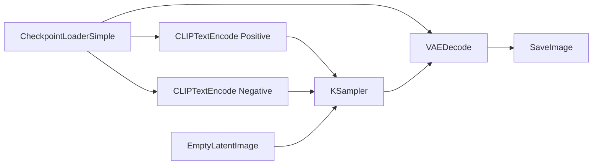

This guide will help you create your first AI-generated image using ComfyUI.

## Prerequisites

Before you begin, make sure you have:

- [Installed ComfyUI](/installation)
- At least one checkpoint model (e.g., SD 1.5 or SDXL)
- Basic understanding of text-to-image generation

## Starting ComfyUI

Launch ComfyUI using your preferred method:

<Tabs>
  <Tab title="Desktop App">
    Double-click the ComfyUI application icon.
  </Tab>
  
  <Tab title="Command Line">
    ```bash
    python main.py
    ```
  </Tab>
  
  <Tab title="comfy-cli">
    ```bash
    comfy launch
    ```
  </Tab>
</Tabs>

ComfyUI will start and open in your web browser at `http://127.0.0.1:8188`

## Your First Workflow

ComfyUI loads with a default text-to-image workflow. Here's how to use it:

<Steps>
  <Step title="Load a checkpoint model">
    1. Click on the **CheckpointLoaderSimple** node
    2. Select a model from the dropdown (e.g., `v1-5-pruned-emaonly.safetensors`)
    3. Place your checkpoint files in `models/checkpoints/` directory
  </Step>

  <Step title="Enter your prompts">
    **Positive Prompt (CLIPTextEncode):**
    ```
    masterpiece, best quality, beautiful landscape, mountains, sunset
    ```
    
    **Negative Prompt (CLIPTextEncode):**
    ```
    blurry, low quality, distorted
    ```
  </Step>

  <Step title="Configure generation settings">
    In the **KSampler** node:
    - **Steps**: 20-30 (more steps = higher quality, slower)
    - **CFG Scale**: 7-8 (how closely to follow your prompt)
    - **Sampler**: euler or dpmpp_2m (sampling algorithm)
    - **Scheduler**: normal or karras
    - **Seed**: Random number (use same seed for consistent results)
  </Step>

  <Step title="Set image dimensions">
    In the **EmptyLatentImage** node:
    - **Width**: 512 or 768
    - **Height**: 512 or 768
    - Keep dimensions as multiples of 64
  </Step>

  <Step title="Generate your image">
    Click **Queue Prompt** or press `Ctrl+Enter`
    
    Watch the progress bar and wait for generation to complete.
  </Step>

  <Step title="View and save your result">
    - Your image appears in the **SaveImage** node
    - Images are automatically saved to `output/` directory
    - Right-click the image to download or save
  </Step>
</Steps>

## Understanding the Basic Workflow

The default workflow connects these nodes:



**Node Roles:**
- **CheckpointLoaderSimple**: Loads the AI model
- **CLIPTextEncode**: Converts text prompts to embeddings
- **EmptyLatentImage**: Creates blank latent space
- **KSampler**: Generates image in latent space
- **VAEDecode**: Converts latent to viewable image
- **SaveImage**: Saves the final result

## Quick Tips

<AccordionGroup>
  <Accordion title="Improve image quality">
    - Increase steps to 30-40
    - Use samplers like `dpmpp_2m` or `dpmpp_sde`
    - Add more descriptive keywords to your prompt
    - Use negative prompts to avoid unwanted elements
  </Accordion>

  <Accordion title="Speed up generation">
    - Reduce steps to 15-20
    - Use smaller image dimensions (512x512)
    - Enable `--highvram` if you have enough VRAM
    - Use faster samplers like `euler_a` or `lcm`
  </Accordion>

  <Accordion title="Get consistent results">
    - Use the same seed value
    - Lock your prompt and settings
    - Save your workflow: `File → Save`
  </Accordion>

  <Accordion title="Experiment with variations">
    - Change the seed number
    - Adjust CFG scale (7-15 range)
    - Try different samplers and schedulers
    - Modify prompt keywords
  </Accordion>
</AccordionGroup>

## Keyboard Shortcuts

Essential shortcuts to speed up your workflow:

| Shortcut | Action |
|----------|--------|
| `Ctrl+Enter` | Queue prompt for generation |
| `Ctrl+S` | Save workflow |
| `Ctrl+O` | Load workflow |
| `Space` | Pan canvas |
| `Double-Click` | Open node search |
| `Ctrl+Z` | Undo |
| `Delete` | Delete selected nodes |

## Next Steps

<CardGroup cols={2}>
  <Card title="Learn Core Concepts" icon="book" href="/concepts/workflows">
    Understand how workflows and nodes work together
  </Card>
  
  <Card title="Explore Models" icon="cube" href="/models/image-models">
    Discover supported image generation models
  </Card>
  
  <Card title="Try Tutorials" icon="graduation-cap" href="/guides/text-to-image">
    Follow step-by-step guides for common tasks
  </Card>
  
  <Card title="Use the API" icon="code" href="/api/overview">
    Integrate ComfyUI into your applications
  </Card>
</CardGroup>

## Troubleshooting

<Warning>
If you encounter issues, check the [Common Issues](/guides/common-issues) guide or visit the [Discord community](https://comfy.org/discord) for help.
</Warning>

**Common problems:**

- **No models available**: Place checkpoint files in `models/checkpoints/`
- **Out of memory**: Reduce image size or use `--lowvram` flag
- **Black images**: Try `--force-fp32` flag (GTX 16 series cards)
- **Slow generation**: Enable `--fast` for optimizations
